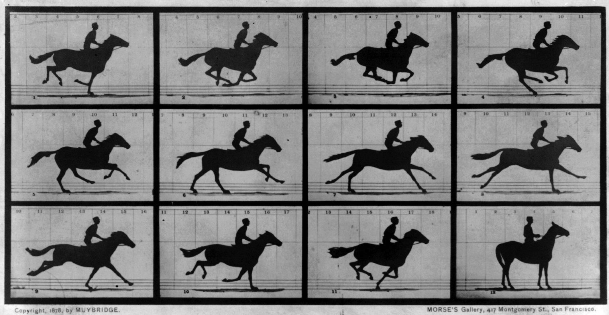

<!---->

Legged animals change their gait pattern according to their locomotion speed, e.g., walking, trotting, and galloping. Our analysis by computer simulations and theoretical investigation explain that many characteristics of locomotor parameters observed in many legged animals, e.g., step length, stride period, and gait transition, are the results of the optimization based on energetic efficiency.
