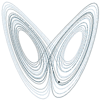

 ([Lorenz attractor from WikiMedia](https://commons.wikimedia.org/wiki/File:A_Trajectory_Through_Phase_Space_in_a_Lorenz_Attractor.gif))

カオスの初期値鋭敏性を表す言葉に"バタフライ効果"がある。
これについての面白い論文があった。

[R.C.Hilborn, "Sea gulls, butterflies, and grasshoppers: A brief history of the butterfly effect in nonlinear dynamics", pp. 425-427, Am. J. Phys. 72(4), 2004](http://aapt.scitation.org/doi/abs/10.1119/1.1636492)

タイトルを見た時はカモメや蝶やバッタの個体数変動がカオス的という話かと思ったら全然違って，**なぜカモメが蝶に化けたか**という話。

<!--more-->

なんでも，ローレンツが初めてカオスについて報告した論文([Lorenz, 1963](http://eaps4.mit.edu/research/Lorenz/Predictability_hydrodynamic_flow_1963.pdf))で比喩に使っていたのは"カモメ"だったらしい。
確かに，論文の一番最後から2文目に以下のようにある。

> _One meteorologist remarked that if the theory were correct, one flap of a **sea gull's** wings would be enough to alter the course of the weather forever. _

[ローレンツ・アトラクタ](https://ja.wikipedia.org/wiki/ローレンツ方程式)が蝶の形に見えるから"蝶"で例えたのかなと思っていたが，ローレンツが"蝶"を比喩に使った時期には，あのアトラクタの形を確認したシミュレーションはなかったはずだと著者はいくつかの論文にある図を根拠に説明する。また，とある小説のエピソードが関連するらしいと聞いたが，ローレンツはその小説のことは知らなかったらしいとか，また別の本が関係あるんじゃないかと聞いたが，その本には蝶は出てこないなどの調査結果が綿々と書いてある(1ページ程度だけど)。

ちなみに結論は，「カモメが蝶になったのは，いろいろなちょっとした原因がもとで起きた分岐現象の結果のようだ」としており，明確な原因は発見できなかったようだが，学者らしいマニアックな調べ方(著者は物理学者)を楽しめる論文だった。

さらに，"Grasshoppers were first"というsectionがあって，19世紀末にはバタフライ効果を示唆する論文が書かれていた(!)らしく，その本では"バッタ"が蝶の代わりに使われていたとのこと。

