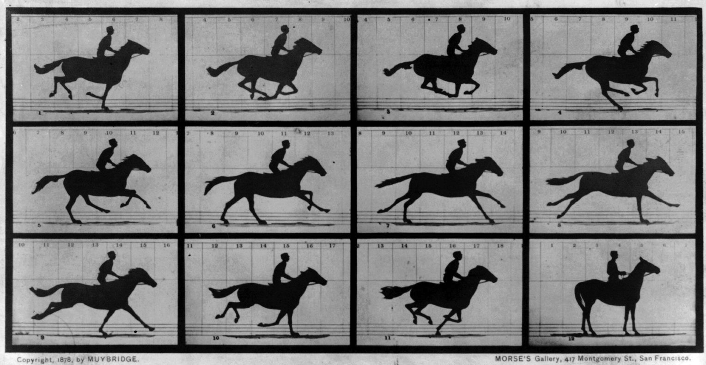

### ウォーク・トロット・ギャロップの謎

馬や猫、ナナフシ、ゴキブリなど、多くの多足歩行動物は、移動速度によって歩行パターンを変化させます。 この歩行パターンの変化が、移動に要するエネルギー消費とどのような関係にあるかを、理論的に考察してきました。
具体的には，ロボット工学の手法を利用して，最もエネルギー消費を抑える足の振り幅，足の運動周期等を数値計算により求め， その結果を実際の歩行パターンの特徴と比較します． 

---

その結果，__多足歩行動物の歩行運動はエネルギー消費を最小に抑える合理的な運動である__ ことを示唆する結果を得てきました．

### 腕を動かすための運動計画

目の前にあるコップをつかむために手を伸ばすとき，腕の動かす経路や速度の選び方は無数にあります。
先行研究では，腕の動きのなめらかさに注目したジャーク最小仮説，トルク変化最小仮説や，終端での手先のぶれを抑えることに注目した終点分散最小仮説等が有力な候補として議論されています。
私たちは，腕の動かし方についても歩行の場合と同様に消費エネルギー最小仮説で説明できると考え，この仮説の妥当性を説明するための理論的研究を行っています。

[Related papers](../papers/#planning)
