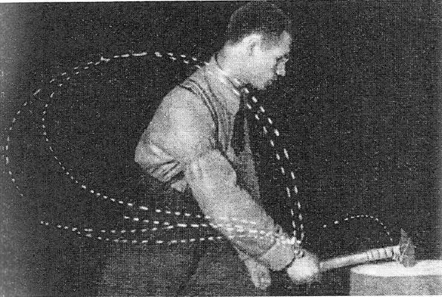

20世紀はじめにモーションキャプチャシステムを開発し，
バイオメカニクス分野の基礎を築いたロシアの生理学者Bernsteinは，熟練した鍛冶屋の運動を計測して面白いことを発見しました。
熟練工の運動は機械のように再現性の高い運動を繰り返すことができるかと思いきや，鎚を打つたびに腕の軌道は異なっており，にも関わらず鎚先は狙いを定めた位置に吸い込まれるように動いていくことに気づいたのです。

---

そこで，Bernsteinは，(1) 我々の神経系は遂行タスクを達成するために重要な部分には注意を払っているが，それ以外の点にはあまりちゅういをはらっておらず，(2) ヒトの巧みさはこのように多様な方法でタスクを遂行できる点にあると考えました。

ヒトは無意識のうちに様々な運動学習を行っており，その内容を意識したり言語化したりすることが難しいことが，運動スキルの伝達のための大きな問題ですが，Bernsteinの考えが正しいとすると，様々な運動に熟練したヒトの運動のばらつきの様子を観察することで，これまで気づけなかった運動のコツ(暗黙知)を探り出せる可能性があります。
そこで，ばらつきの分布を解析する手法であるUncontrolled manifold (UCM) 解析によって，運動のコツを探る研究をすすめています。
これまでは歩行運動を主に扱ってきましたが，スポーツや楽器演奏等の解析もしていく予定です。

[Related papers](../papers/#Bernstein)
